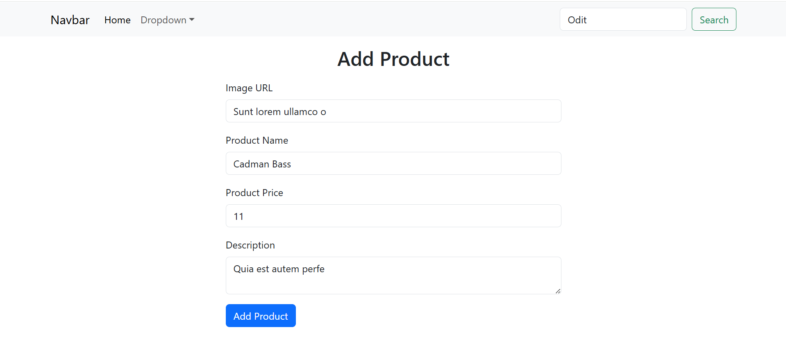
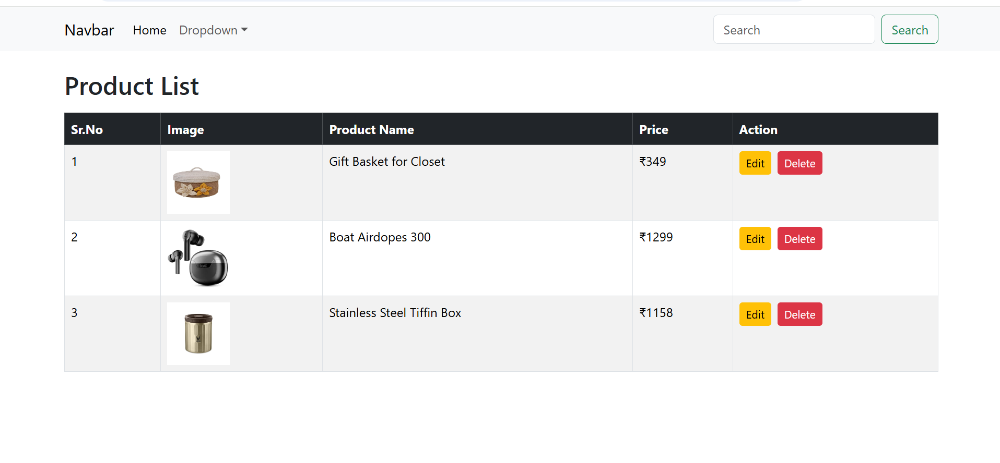
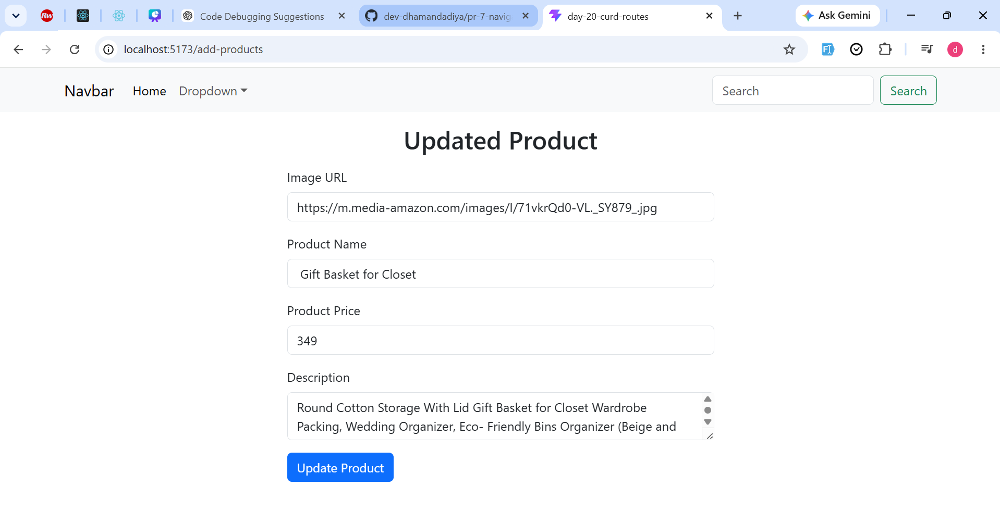
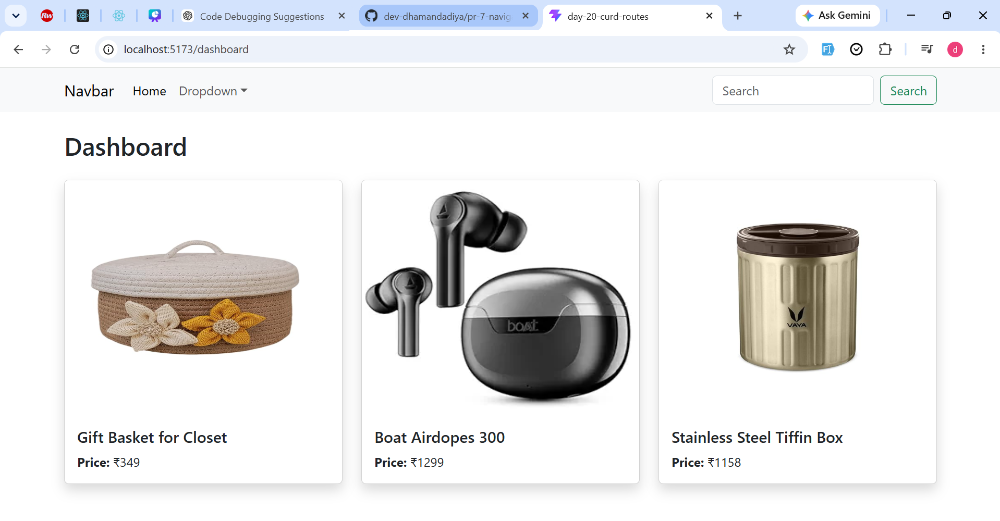

# 🛍️ Product Management System

A React.js-based Product Management System that allows users to add, view, edit, delete, and search products. The application uses Local Storage for data persistence and React Router for navigation between pages.

---

## 🚀 Features

* Add New Product
* View Product List
* Edit Existing Product
* Delete Product
* Search Products
* Form Validation
* Local Storage Integration
* React Router Navigation
* Responsive Bootstrap UI
* Dashboard View

---

## 📸 Screenshots

### ➕ Add Product Page



### 📋 Product List Page



### 📊 Updated Page



### 📊 Dashboard Page



---

## 🎥 Project Demo Video

Watch the complete project demonstration here:

👉 **[Watch Demo Video](PASTE_GOOGLE_DRIVE_OR_YOUTUBE_LINK_HERE)**

---

## 🛠️ Technologies Used

* React.js
* JavaScript (ES6+)
* React Router DOM
* Bootstrap 5
* HTML5
* CSS3
* Local Storage

---

## 📂 Project Structure

```text
src/
│
├── Components/
│   └── Header.jsx
│
├── Pages/
│   ├── Home.jsx
│   ├── Dashboard.jsx
│   ├── Add_Products.jsx
│   ├── View_Products.jsx
│   ├── Login.jsx
│   └── Register.jsx
│
├── App.jsx
└── main.jsx
```

---

## ⚙️ Installation

### Clone Repository

```bash
git clone https://github.com/dev-dhamandadiya/pr-7-navigator-react.js.git
```

### Move to Project Folder

```bash
cd pr-7-navigator-react.js
```

### Install Dependencies

```bash
npm install
```

### Start Development Server

```bash
npm run dev
```

---

## 📌 Application Workflow

### 1. Add Product

Users can add product details such as:

* Product Image URL
* Product Name
* Product Price
* Product Description

### 2. Product Validation

The application validates:

* Empty Fields
* Required Inputs
* Product Information

### 3. View Products

All products are displayed in a table with:

* Product Image
* Product Name
* Product Price
* Actions

### 4. Edit Product

Users can update existing product details.

### 5. Delete Product

Users can remove products from the list.

### 6. Search Product

Products can be searched by name.

### 7. Local Storage

All product data is stored in browser Local Storage.

---

## 👩‍💻 Developer

**Diya Dhamanda**

GitHub: https://github.com/dev-dhamandadiya

---

## 📄 License

This project was developed for learning and practice purposes.
